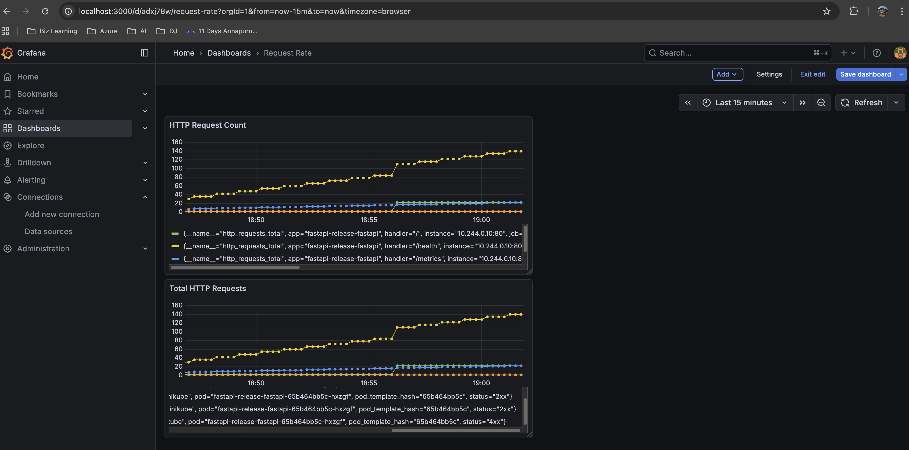
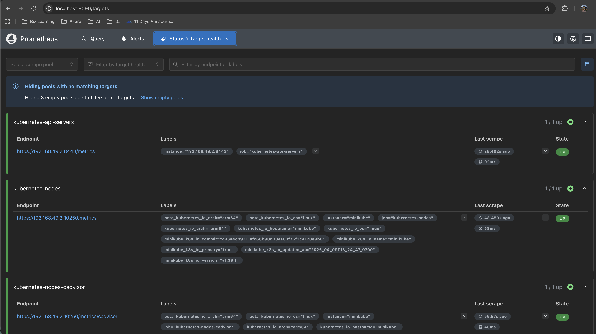
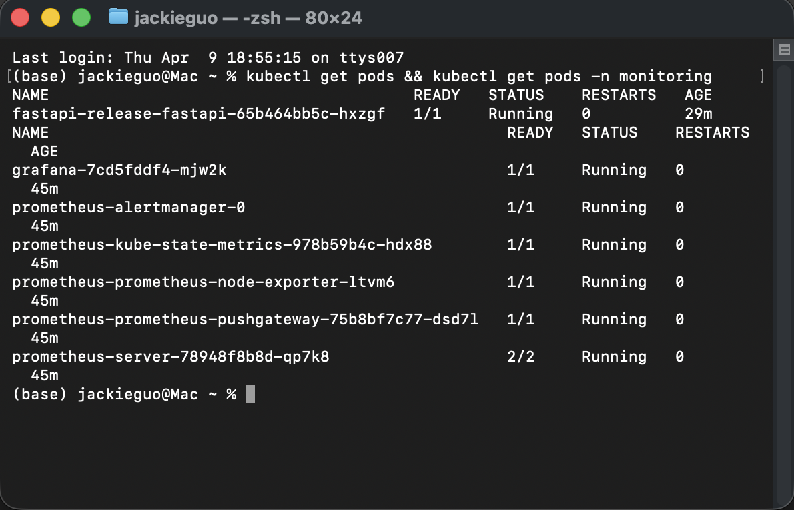
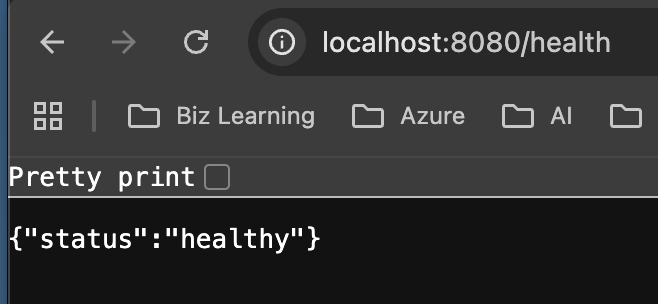

# k8s-observability-platform

A production-style Kubernetes observability platform running locally on Minikube.
Demonstrates end-to-end container orchestration, metrics collection, and visualisation.

## Architecture

FastAPI app (Docker) → Kubernetes (Minikube) → Helm chart → Prometheus → Grafana

## Tech Stack

| Layer | Tool |
|---|---|
| App | Python FastAPI + Docker |
| Orchestration | Kubernetes (Minikube) |
| Packaging | Helm 3 |
| Metrics | Prometheus |
| Dashboard | Grafana |
| Automation | Bash deploy script |
| Config management | Ansible |

## Key Features

- One-command deployment via `./scripts/deploy.sh`
- Auto-instrumented metrics via prometheus-fastapi-instrumentator
- Kubernetes liveness health probes on `/health` endpoint
- Helm chart for repeatable configurable deployments
- Grafana dashboard showing HTTP request count
- Ansible playbook for bootstrapping tool dependencies

## How to Run

Requirements: Docker Desktop, Minikube, kubectl, Helm, Ansible

```bash
git clone https://github.com/KTZMJackie/k8s-observability-platform
cd k8s-observability-platform
chmod +x scripts/deploy.sh
./scripts/deploy.sh
```

Then access via port-forward:

```bash
kubectl port-forward deployment/fastapi-release-fastapi 8080:80
```

## API Endpoints

| Endpoint | Description |
|---|---|
| GET / | Service status |
| GET /health | Health check for Kubernetes liveness probe |
| GET /metrics | Prometheus metrics endpoint |

## Screenshots



## Grafana Dashboard

Dashboard JSON is version-controlled at `grafana/fastapi-dashboard.json`.

To import:
1. Open Grafana → Dashboards → Import
2. Upload `grafana/fastapi-dashboard.json`
3. Select your Prometheus data source
4. Click Import

Panels included:
- Request Rate (req/s)
- Request Latency (p50 / p95)
- Error Rate (5xx)
- Total Requests by Endpoint





## Author

Built as part of a hands-on DevOps/cloud engineering portfolio.
