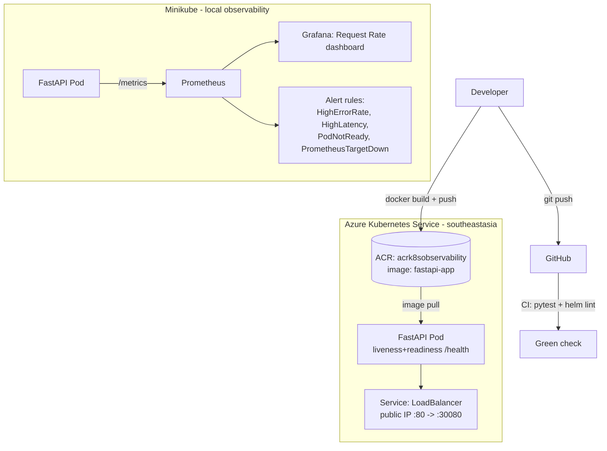

# k8s-observability-platform


A FastAPI service packaged as a Helm chart and deployed two ways: to a managed **Azure Kubernetes Service (AKS)** cluster with a public LoadBalancer, and to a local **Minikube** cluster where the full Prometheus + Grafana observability stack (with custom alerting rules) runs. The same chart runs in both environments.

## What this demonstrates

- Deploying a containerised app to **AKS** from an image in **Azure Container Registry (ACR)**, exposed via an Azure LoadBalancer with a public IP
- Helm-packaged, repeatable deployments (`fastapi-app` chart)
- A real observability stack — **Prometheus** scraping app `/metrics`, **Grafana** dashboards, and **custom alerting rules**
- CI on every push: pytest + `helm lint`, PR blocked on failure
- Kubernetes liveness/readiness probes, Prometheus auto-instrumentation

## Architecture


```mermaid
graph TD
    Dev[Developer] -->|git push| GH[GitHub]
    GH -->|CI: pytest + helm lint| GREEN[Green check]

    Dev -->|docker build + push| ACR[(ACR: acrk8sobservability\nimage: fastapi-app)]

    subgraph AKS[Azure Kubernetes Service - southeastasia]
        ACR -->|image pull| POD[FastAPI Pod\nliveness+readiness /health]
        POD --> LB[Service: LoadBalancer\npublic IP :80 -> :30080]
    end

    subgraph LOCAL[Minikube - local observability]
        POD2[FastAPI Pod] -->|/metrics| PROM[Prometheus]
        PROM --> GRAF[Grafana: Request Rate dashboard]
        PROM --> ALERTS[Alert rules:\nHighErrorRate, HighLatency,\nPodNotReady, PrometheusTargetDown]
    end
```

## Environments

| | AKS (cloud) | Minikube (local) |
|---|---|---|
| Cluster | Managed AKS, region Southeast Asia, K8s v1.33.6, VMSS node pool (Ubuntu 22.04) | Single-node Minikube |
| App | `fastapi-release` (Helm chart `fastapi-app-0.1.0`) | Same chart |
| Exposure | `LoadBalancer` service, public IP, `80 -> 30080` | NodePort |
| Registry | Image pulled from ACR `acrk8sobservability` | Built into Minikube's Docker daemon |
| Observability | app `/metrics` exposed publicly | **Full Prometheus + Grafana + alerting stack** |

## Tech Stack

| Layer | Tool |
|---|---|
| Orchestration | **Azure Kubernetes Service (AKS)** + Minikube (local) |
| Registry | Azure Container Registry (ACR) |
| App | Python FastAPI + Docker |
| Packaging | Helm 3 (`fastapi-app` chart) |
| Metrics | Prometheus (prometheus-fastapi-instrumentator) |
| Dashboards | Grafana |
| Alerting | Prometheus alerting rules (`alerting_rules.yml`) |
| Automation | Bash deploy scripts, Ansible |
| CI | GitHub Actions (pytest + helm lint) |

## Deploy to AKS

```bash
# Create cluster + ACR (one-time)
az group create --name [rg-name] --location southeastasia
az acr create --resource-group [rg-name] --name acrk8sobservability --sku Basic
az aks create \
  --resource-group [rg-name] \
  --name aks-k8s-observability \
  --node-count 1 \
  --attach-acr acrk8sobservability \
  --generate-ssh-keys

# Build + push image to ACR
az acr build --registry acrk8sobservability --image fastapi-app:v1 ./app

# Connect and deploy
az aks get-credentials --resource-group [rg-name] --name aks-k8s-observability
helm upgrade --install fastapi-release ./helm/fastapi-app \
  --set image.repository=acrk8sobservability.azurecr.io/fastapi-app \
  --set service.type=LoadBalancer

kubectl get svc fastapi-release-service   # note the EXTERNAL-IP
```

Verify (values from a live deployment):

```
$ kubectl get nodes
NAME                            STATUS   VERSION
aks-default-10199626-vmss000000 Ready    v1.33.6

$ kubectl get svc fastapi-release-service
NAME                     TYPE           EXTERNAL-IP     PORT(S)
fastapi-release-service  LoadBalancer   20.197.65.33    80:30080/TCP

$ curl http://20.197.65.33/health
{"status":"healthy"}
```

## Local development + observability (Minikube)

Zero cloud cost. Brings up the app **and** the full monitoring stack.

```bash
export GRAFANA_PASSWORD=... API_KEY=...
chmod +x scripts/deploy.sh
./scripts/deploy.sh
```

The script starts Minikube, builds the image, installs Prometheus and Grafana via Helm, and deploys the app. Then:

```bash
kubectl port-forward -n monitoring svc/grafana 3000:3000
kubectl port-forward -n monitoring svc/prometheus-server 9090:80
```

## Observability

**Prometheus** scrapes the app's `/metrics` endpoint (auto-instrumented: `http_requests_total`, request latency, sizes, Python/process metrics).

**Grafana** — the version-controlled `Request Rate` dashboard (`grafana/fastapi-dashboard.json`) shows HTTP request count and total requests by endpoint/status. Import via Dashboards → Import → select the Prometheus datasource.

**Alerting** — custom rules in `alerting_rules.yml`, evaluated by Prometheus:

| Alert | Condition | Severity |
|---|---|---|
| `HighErrorRate` | elevated 5xx rate | warning |
| `HighLatency` | request latency over threshold | warning |
| `PodNotReady` | `kube_pod_status_ready{condition="true"} == 0` for 1m | critical |
| `PrometheusTargetDown` | a scrape target is down | critical |

## Screenshots

- `screenshots/aks-cluster-info.png` — AKS control plane + nodes
- `screenshots/aks-loadbalancer.png` — public IP serving `/health`
- `screenshots/grafana-request-rate.png` — Grafana dashboard
- `screenshots/prometheus-alerts.png` — firing/inactive alert rules

## CI

GitHub Actions runs `pytest` and `helm lint` on every push and pull request; failures block the PR.

## Author

Cloud / DevOps engineer — AZ-104 certified. github.com/KTZMJackie

---
