# k8s-observability-platform

A production-style Kubernetes observability platform deployed on both local Minikube and Azure AKS.
Demonstrates end-to-end container orchestration, metrics collection, and visualisation — provisioned via Terraform.

## Architecture

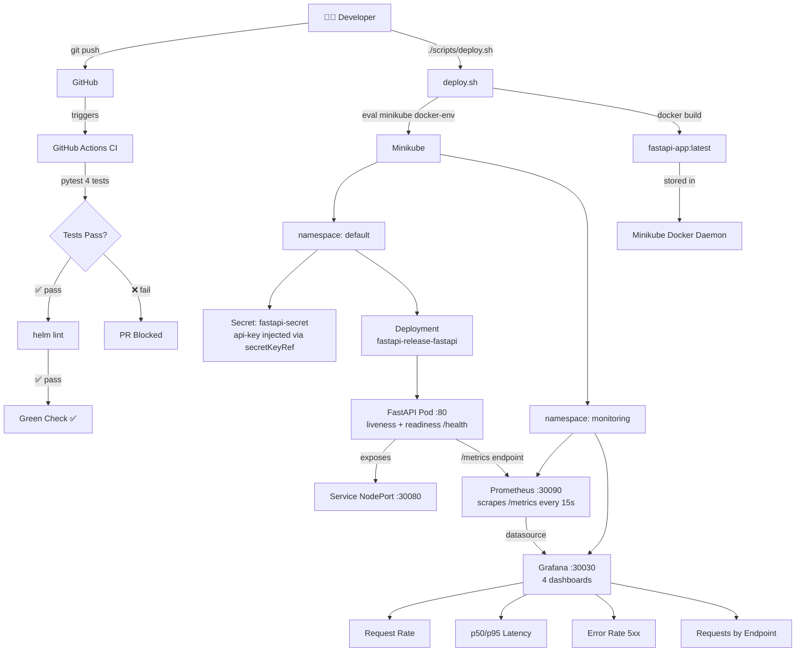
```mermaid
graph TD
    Dev[👩‍💻 Developer] -->|git push| GH[GitHub]
    GH -->|triggers| CI[GitHub Actions CI]
    CI -->|pytest 4 tests| T{Tests Pass?}
    T -->|✅ pass| HL[helm lint]
    T -->|❌ fail| BLOCK[PR Blocked]
    HL -->|✅ pass| GREEN[Green Check ✅]

    Dev -->|./scripts/deploy.sh| DS[deploy.sh]
    DS -->|eval minikube docker-env| MK[Minikube]
    DS -->|docker build| IMG[fastapi-app:latest]
    IMG -->|stored in| MKDOCKER[Minikube Docker Daemon]

    MK --> NS1[namespace: default]
    MK --> NS2[namespace: monitoring]

    NS1 --> SEC[Secret: fastapi-secret\napi-key injected via secretKeyRef]
    NS1 --> DEP[Deployment\nfastapi-release-fastapi]
    DEP --> POD[FastAPI Pod :80\nliveness + readiness /health]
    POD -->|exposes| SVC[Service NodePort :30080]

    NS2 --> PROM[Prometheus :30090\nscrapes /metrics every 15s]
    NS2 --> GRAF[Grafana :30030\n4 dashboards]

    POD -->|/metrics endpoint| PROM
    PROM -->|datasource| GRAF

    GRAF --> D1[Request Rate]
    GRAF --> D2[p50/p95 Latency]
    GRAF --> D3[Error Rate 5xx]
    GRAF --> D4[Requests by Endpoint]
```

## Tech Stack

| Layer | Tool |
|---|---|
| App | Python FastAPI + Docker |
| Orchestration | Kubernetes (Minikube + AKS) |
| IaC | Terraform |
| Packaging | Helm 3 |
| Registry | Azure Container Registry (ACR) |
| Metrics | Prometheus |
| Dashboard | Grafana |
| CI/CD | GitHub Actions |
| Automation | Bash scripts |
| Config management | Ansible |

## Key Features

- One-command local deployment via `./scripts/deploy.sh`
- Full AKS deployment via Terraform IaC in `infra/`
- ACR integration with AKS via Managed Identity (no credentials)
- Auto-instrumented metrics via prometheus-fastapi-instrumentator
- Kubernetes liveness and readiness probes on `/health`
- Helm chart for repeatable configurable deployments
- Grafana dashboard showing HTTP request count, latency, error rate
- Ansible playbook for bootstrapping DevOps tool dependencies
- Kubernetes Secret for API key injection via `secretKeyRef`

## AKS Deployment (Azure Kubernetes Service)

This project has been deployed to a production AKS cluster on Azure, provisioned via Terraform.

### AKS Architecture

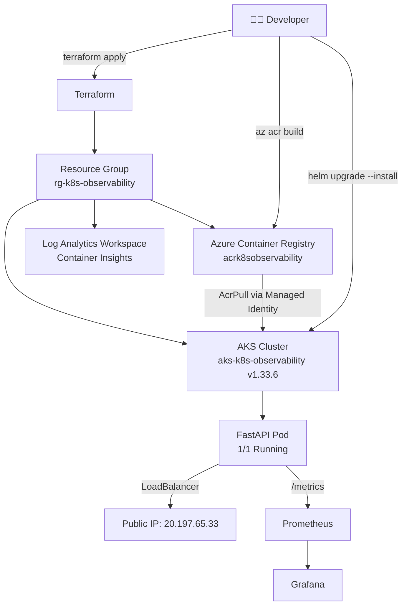
```mermaid
graph TD
    Dev[👩‍💻 Developer] -->|terraform apply| TF[Terraform]
    TF --> RG[Resource Group\nrg-k8s-observability]
    RG --> AKS[AKS Cluster\naks-k8s-observability v1.33.6]
    RG --> ACR[Azure Container Registry\nacrk8sobservability]
    RG --> LAW[Log Analytics Workspace\nContainer Insights]

    Dev -->|az acr build| ACR
    ACR -->|AcrPull via Managed Identity| AKS

    Dev -->|helm upgrade --install| AKS
    AKS --> POD[FastAPI Pod\n1/1 Running]
    POD -->|LoadBalancer| LB[Public IP: 20.197.65.33]
    POD -->|/metrics| PROM[Prometheus]
    PROM --> GRAF[Grafana]
```
### Infrastructure (Terraform)

All AKS infrastructure is provisioned via Terraform in `infra/`:

| Resource | Name | Purpose |
|---|---|---|
| Resource Group | rg-k8s-observability | Container for all resources |
| AKS Cluster | aks-k8s-observability | Managed Kubernetes (v1.33.6) |
| ACR | acrk8sobservability | Container image registry |
| Log Analytics Workspace | law-k8s-observability | Container Insights monitoring |
| Role Assignment | AcrPull | AKS pulls from ACR via Managed Identity — no credentials |

### Deploy to AKS

```bash
# 1. Provision infrastructure
cd infra/
terraform init
terraform apply

# 2. Connect kubectl to AKS
az aks get-credentials \
  --resource-group rg-k8s-observability \
  --name aks-k8s-observability

# 3. Build and push image to ACR
az acr build \
  --registry acrk8sobservability \
  --image fastapi-app:latest ./app

# 4. Deploy via Helm
helm upgrade --install fastapi-release ./helm/fastapi-app \
  --set image.repository=acrk8sobservability.azurecr.io/fastapi-app \
  --set image.tag=latest \
  --set image.pullPolicy=Always \
  --set env.apiKey="${API_KEY}" \
  --set service.type=LoadBalancer

# 5. Verify
kubectl get nodes
kubectl get pods
kubectl get svc

# 6. Teardown (stops billing)
cd infra/
terraform destroy
```

### AKS Deployment Screenshots

| What | Screenshot |
|---|---|
| AKS node Ready (v1.33.6) | 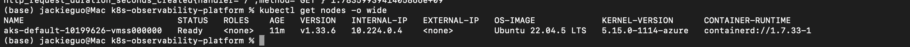 |
| Pod Running 1/1 | 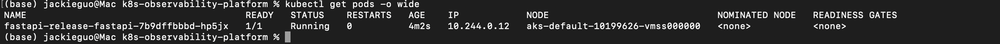 |
| LoadBalancer with public IP | 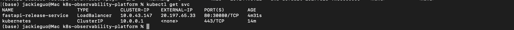 |
| Helm release deployed | 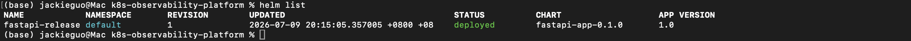 |
| AKS cluster info | 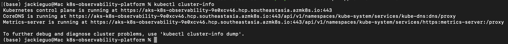 |
| ACR image pushed | 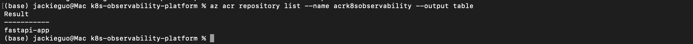 |
| Live endpoint response | 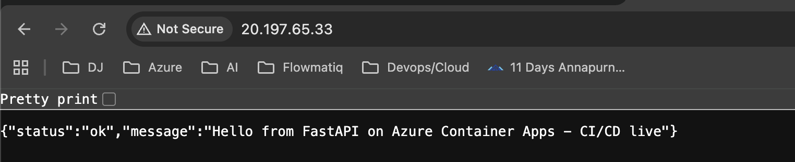 |
| Health check | 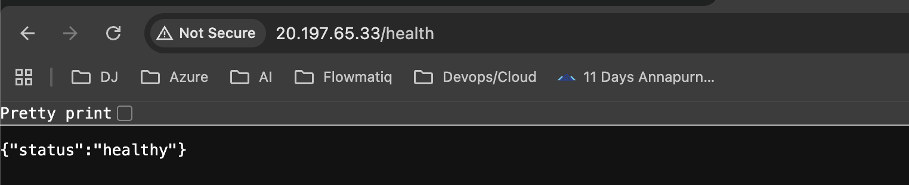 |
| Prometheus metrics live | 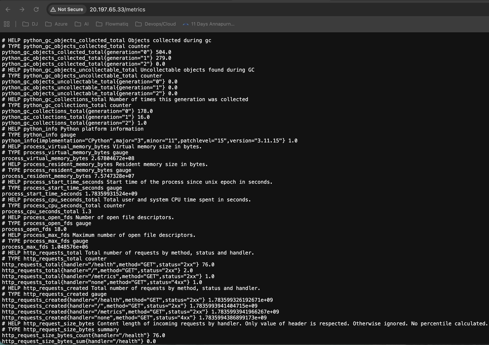 |

## Local Minikube Deployment

### How to Run

Requirements: Docker Desktop, Minikube, kubectl, Helm, Ansible

```bash
git clone https://github.com/KTZMJackie/k8s-observability-platform
cd k8s-observability-platform
chmod +x scripts/deploy.sh
export GRAFANA_PASSWORD=yourpassword
export API_KEY=yourapikey
./scripts/deploy.sh
```

Then access via port-forward:

```bash
kubectl port-forward deployment/fastapi-release-fastapi 8080:80
```

## API Endpoints

| Endpoint | Description |
|---|---|
| GET / | Service status |
| GET /health | Health check for Kubernetes liveness probe |
| GET /metrics | Prometheus metrics endpoint |

## Scripts

| Script | Purpose |
|---|---|
| `scripts/deploy.sh` | Spin up full local stack (Minikube + Helm) |
| `scripts/healthcheck.sh` | HTTP health check all services with exit codes |
| `scripts/cluster-status.sh` | Full kubectl + Helm cluster state overview |
| `scripts/cleanup.sh` | Tear down full stack cleanly |

## Screenshots


## Grafana Dashboard

Dashboard JSON is version-controlled at `grafana/fastapi-dashboard.json`.

To import:
1. Open Grafana → Dashboards → Import
2. Upload `grafana/fastapi-dashboard.json`
3. Select your Prometheus data source
4. Click Import

Panels included:
- Request Rate (req/s)
- Request Latency (p50 / p95)
- Error Rate (5xx)
- Total Requests by Endpoint


## Author

Built as part of a hands-on DevOps/cloud engineering portfolio targeting Azure DevOps and Cloud Engineer roles in Singapore.